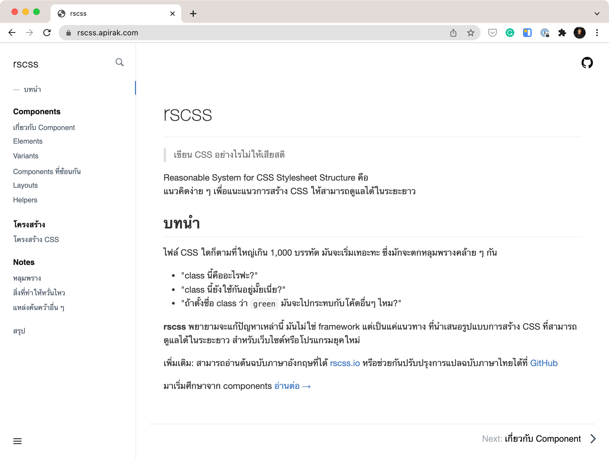

# sushi
Sushi is Design System build for SET

## Demo

https://apirak.com/sushi/

_will move to SET domain when ready_

## Install

* Navigate to the directory where the sushi folder is located using Terminal.
* Execute `npm install`.

## Run

* Execute `npm start` or `gulp`.
* Open http://localhost:8080/ on your web browser.

## Build

* Execute `gulp build`.

## Folder Structure

```
+ assets : Asset after compiled
  + css
  + fonts
  + images 
  + js
+ src
  + pug
    + base
      - base.pug : HTML, HEADER, BODY, CSS, Java Script.
    + content
      - [component].png : Each component will implement here
    + pages
      - index.pug : Main index.
  + sass
    + components
      - _components.sass : will put component style here
    - sushi.sass : All Style here (for now)
    - font_icon.sass: Font name
    - font_variables.sass : Font code;
- index.html : Prebuild HTML file.
```

### SASS Guideline

https://rscss.apirak.com/



## Why Pug & SCSS

It's not just about beautiful syntax. Pug and SCSS allow us to write modular and reusable markup. 

* Learn Pug https://www.sitepoint.com/a-beginners-guide-to-pug/
* Learn SASS https://sass-lang.com/guide


## Gulp Plugins

* [gulp-connect](https://www.npmjs.com/package/gulp-connect) : Run webserver (with livereload).
* [gulp-plumber](https://www.npmjs.com/package/gulp-plumber) : Prevent pipe breaking caused by errors from gulp plugins.
* [gulp-pug](https://www.npmjs.com/package/gulp-pug) : Gulp plugin for compiling Pug templates, compile Pug into HTML.
* [gulp-rename](https://www.npmjs.com/package/gulp-rename) : Gulp plugin to rename files easily, adding `.min` suffix.
* [gulp-sass](https://www.npmjs.com/package/gulp-sass) : Compile your Sass into CSS.
* [gulp-uglify](https://www.npmjs.com/package/gulp-uglify) : Minify your JS.

## Special Thank

* https://github.com/sulistryono/pug-sass-starter