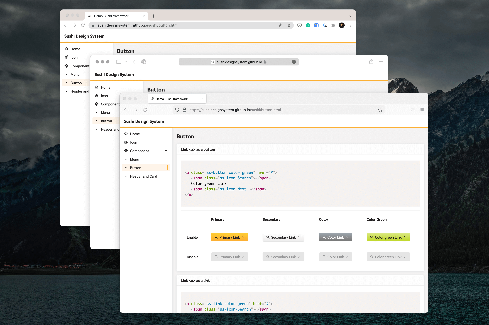

# Sushi
Sushi Design System helps us work together to build great experience for all of SET co-workers and listed companies.

We prepare HTML/CSS component as building blocks when you develop new products and features. We also prepare Figma's components for designers who prepare prototypes before development.



See the actual result here: https://sushidesignsystem.github.io/sushi

See Figma file here: [SET Main web](https://www.figma.com/file/YMSF7WZuIfrg33Rk9v1kYg/%E2%9D%96-SET-MAIN-%2F-Web?node-id=496%3A7663)

## Install

* Navigate to the directory where the sushi folder is located using Terminal.
* Execute `npm install`.

If you don't have npm

* Install Homebrew: `/bin/bash -c "$(curl -fsSL https://raw.githubusercontent.com/Homebrew/install/HEAD/install.sh)"`

* Install node: `brew install node`

## Run

* Execute `npm start` or `gulp`.
* Open http://localhost:8080/ on your web browser.

## Compile icon SET

* Prepare SVG icons in `/assets/icons`
* Execute `gulp compile-font-icon`

New fonts (eot, ttf and woff) will generate in `/assets/fonts` along with `/src/scss/icon_font.scss`

## Folder Structure

```
+ assets : Asset after compiled
  + css
  + download
  + fonts
  + icons
  + images
  + js
+ src
  + pug
    + base
      - base.pug : HTML, HEADER, BODY, CSS, Java Script.
    + content
      - [content].pug : Content that not component
    + pages
      - index.pug : Main index.
      - [compoent].pug : Each components will have their own page.
  + sass
    + components
      - ss-[components].sass : Put components style here
    - base.scss: Style that use across all component
    - icon_font.sass: Config name of icons
    - sushi-page.scss: Style for this site but not relate to component
    - sushi.sass : Import all component here
    - variables.sass : All SCSS variable define here;
- index.html : Home page.
- [component].html : Page for each components.
```

## Todo

- [x] Programatic color
- [ ] https://github.com/SET-Design-System/sushi/issues/1
- [ ] TextField @mike
- [ ] Basic Table (Complicate table will change in future)
- [ ] Move from gulp (to parcel to avoid scss bug and better js management in future)

## SASS Guideline


https://rscss.apirak.com/

## Why Pug & SCSS

It's not just about beautiful syntax. Pug and SCSS allow us to write modular and reusable markup.

* Learn Pug https://www.sitepoint.com/a-beginners-guide-to-pug/
* Learn SASS https://sass-lang.com/guide
